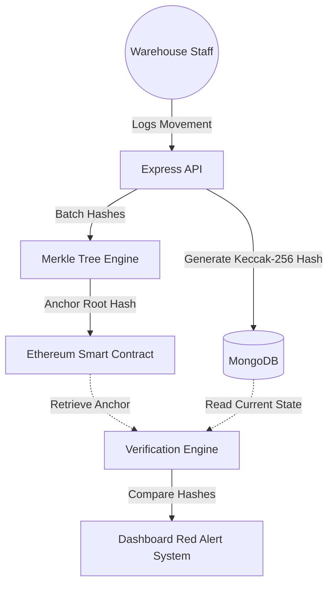

# 🔐 CoreInventory: Immutable Enterprise Supply Chain

> **"Don't trust your database. Verify it with Mathematics."**

CoreInventory is a next-generation Enterprise Resource Planning (ERP) and Inventory Management System designed for a zero-trust world. By leveraging the **Ethereum Blockchain** and **Merkle Tree Cryptography**, CoreInventory ensures that every stock movement—receipts, deliveries, transfers, and adjustments—is mathematically anchored and impossible to tamper with without detection.

---

## 🚀 The Vision: Why CoreInventory?
Traditional inventory systems rely on a single, mutable database. If an administrator or a hacker changes a row in the database, the history is rewritten, and the theft or error is hidden.

**CoreInventory solves this by:**
1. **Cryptographic Anchoring:** Every transaction is hashed using **Keccak-256**.
2. **Blockchain Verification:** Periodically, groups of transactions are batched into a **Merkle Tree**, and the Merkle Root is anchored to an Ethereum Smart Contract.
3. **List-Level Tamper Detection:** The system performs real-time mathematical audits of your database records against their blockchain anchors every time you view them.

---

## ✨ Key Features

### 🏛️ Blockchain Integrity
- **On-Chain Proofs:** Uses Ethers.js to interact with high-performance Solidity smart contracts.
- **Merkle Roots:** Anchors batches of data to minimize gas costs while maintaining maximum security.
- **Proof-of-Existence:** Provides a permanent, legally admissible record of inventory state at any point in time.

### 🛡️ Advanced Security
- **Real-Time Anomaly Detection:** Frontend tables instantly glow **RED** if a database record has been changed since it was anchored.
- **Cryptographic Traceability:** Generate instant Merkle Proofs for any single stock movement to prove its inclusion in a specific blockchain block.

### 🎨 Premium Experience (Hackathon Edition)
- **Fluid UI:** Built with **React** and **Tailwind CSS**, featuring **Plus Jakarta Sans** typography for a professional enterprise feel.
- **Silky Motion:** Integrated **Framer Motion** for smooth page transitions and micro-interactions.
- **Glassmorphism:** A deep, dark-mode specialized theme with refined blur physics and glowing success/failure states.
- **Empty State UX:** Custom vector illustrations for empty database views to guide the user seamlessly through the setup phase.

---

## 🛠️ The Tech Stack

| Layer | Technologies |
| :--- | :--- |
| **Frontend** | React, Vite, Framer Motion, Lucide, Tailwind CSS, Shadcn UI |
| **Backend** | Node.js, Express, MongoDB (Mongoose), JWT JSON Web Tokens |
| **Blockchain** | Solidity, Ethers.js, Hardhat, Sepolia / Local Ethereum Node |
| **Cryptography** | Keccak-256 Hashing, Merkle Tree Construction (crypto-js/ethers) |

---

## 📂 System Architecture



---

## 🚦 Getting Started

### Prerequisites
- [Node.js](https://nodejs.org/) (v16+)
- [MongoDB](https://www.mongodb.com/) (Local or Atlas)
- [Hardhat](https://hardhat.org/) (for local blockchain testing)

### 1. Blockchain Setup
```bash
cd blockchain
npm install
npx hardhat node # Start local node
npx hardhat run scripts/deploy.js --network localhost # Deploy contract
```

### 2. Backend Setup
```bash
cd backend
npm install
# Create .env with MONGODB_URI and CONTRACT_ADDRESS
npm start
```

### 3. Frontend Setup
```bash
cd frontend
npm install
npm run dev
```

---

## 🧪 The "Failure Cycle" Test (Anti-Tamper Demo)
To see the system's power in a hackathon demo:
1. **Anchor** a movement in the app.
2. Open **MongoDB Compass** and manually edit the `qty` of that record to something else.
3. Refresh the app.
4. **Witness:** The row instantly turns red with a **TAMPERED** badge.
5. **Verify:** Clicking the Shield icon will show a backend rejection: *"Data tampering detected: Record modified since anchoring."*
6. **Revert:** Change the quantity back in MongoDB. The system instantly returns to a "Verified" green state.

---

## 📄 License
Engineering the future of trust in supply chains. Built for the **Modern Enterprise**.

&copy; 2026 CoreInventory Systems. All mathematical rights reserved.